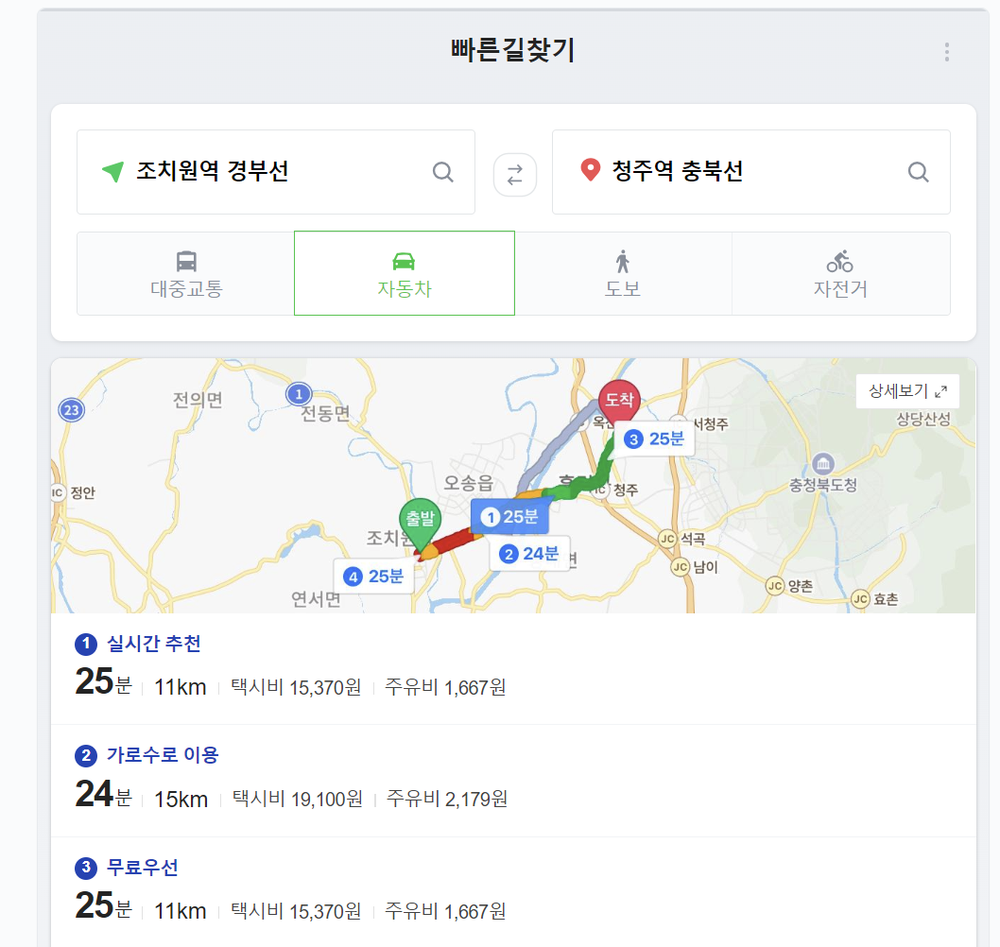
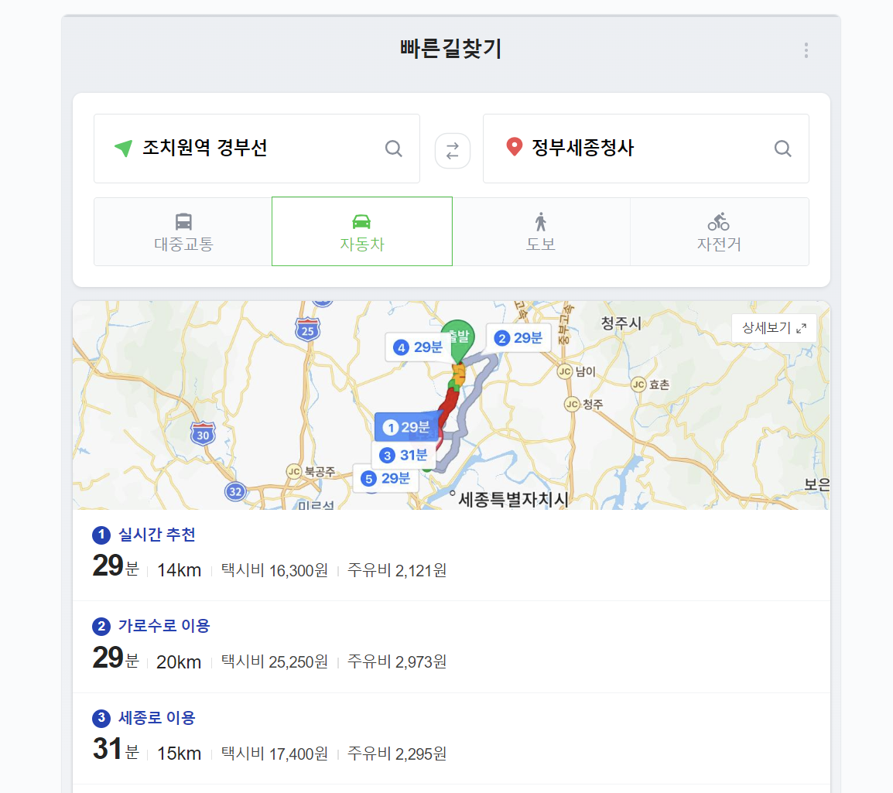
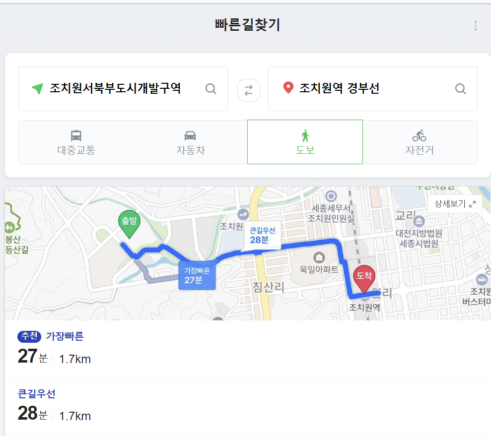

# 도시및환경계획 과목 기말과제 정리.

고려대학교 세종캠퍼스 개설과목인 도시및환경계획의 기말과제와 관련하여 자료조사를 정리한 글.

------------------------------

## 공공데이터 정리
[공공데이터 : 전국미용업 현황 다운받기](https://www.data.go.kr/data/15045037/fileData.do)

[공공데이터 : 지역별 성별 인구 현황](https://www.data.go.kr/data/15097972/fileData.do)

------------------------------

## SWOT 분석

### Strength
- 세종시장은 조치원의 큰 강점임
  
[조치원의 강점 : 세종시장](https://www.hankookilbo.com/News/Read/A2022111115060004760?did=NA)

- 조치원과 청주는 매우 가까우며, 대중교통으로 금방 오갈 수 있다. 이는 **정부세종청사보다 더 가까운 위치다**.

따라서 청주시와의 협력을 꾀하면 강점이 될 수 있다. 청주시를 실질적 모도시(母都市)로 볼 수 있다.

### Weakness
[조치원의 강점 : 세종시장](https://www.hankookilbo.com/News/Read/A2022111115060004760?did=NA)
- 젊은이의 유입이 줄어들고 있음.

  → 인구문제 해결을 위해서 인구 유입을 증가시킬 흡인요인을 찾아야함.

- 조치원 서북부지구 개발구역의 엘리프 아파트 분양가에 대한 대출이자가 비싸다는 의견이 있다.
  [관련기사](http://www.sjsori.com/news/articleView.html?idxno=64162)

### Opportunity

- 조치원 서북부지구 개발구역의 25%는 신혼부부에게 제공될 예정
[관련 뉴스기사](https://www.yna.co.kr/view/AKR20230302135200063?input=1195m)

- 조치원읍의 인구는 4만명으로 현재 세종시에서 가장 많은 수를 차지하고 있다.
  [관련 뉴스기사](https://www.newspim.com/news/view/20230209000880)

- 조치원의 중심시가지인 조치원역은 청춘 조치원 프로젝트로 더 활력을 불어넣고자하고 있다.
  [세종특별자치시 청년조치원 프로젝트 홍보 홈페이지](https://www.sejong.go.kr/youthsejong/sub01_01.do)

  [김민선, 이제선.(2021).중심시가지 내 공공공간의 물리적 환경과 상권 활성화의 관계 - 서울시 신촌동 ‘연세로, 명물거리, 신촌역로, 이화여대길’을 중심으로.한국도시설계학회지 도시설계,22(5),35-54.](https://www.dbpia.co.kr/journal/articleDetail?nodeId=NODE10622013)

- 조치원 서북부지구 개발지역은 조치원역과 약 30분 도보 거리에 있으므로, 근처의 PM을 활용한다면 약 15분 이내에 도착할 수 있어 교통이 편리하다고 볼 수 있다. 하지만, 걷기에는 먼 거리이므로, 더 많은 사람들이 조치원역까지 편하게 이용하기 위해서는 대중교통의 도입이 필요하다고 볼 수 있다.

### Threaten
- 교통문제의 해결이 필요하다. 현재 조치원읍은 가구당 승용차 등록대수가 1.07대 (2022년 기준)으로 상당한 편이다. 
[관련 뉴스기사](http://www.dtnews24.com/news/articleView.html?idxno=743142)

- 조치원 서북부지구 개발구역은 공공청사 위주로 되어있기 때문에, 오후 6시 이후에는 공무원의 퇴근으로 인해 거리가 비어있을 가능성이 높다. 따라서 유동인구가 줄어들기 때문에, 해당 지역에서 Natural Surveillance를 확보하기 어려울 것으로 예상된다. 
  
  이를 방지하기 위해서는 상업시설을 야간에 활발하게 움직일 수 있는 것으로 조성해야한다. 근처의 고려대학교 세종캠퍼스를 비롯한 청년층의 유입을 꾀할 수 있는 시설이 존재하므로, 이를 활용하여 밤에 움직일 수 있는 오락 시설을 일부 배치할 수 있을 것으로 예상된다.

-----------------------
## reference
[수도권정비계획법 시행령 제3조](https://glaw.scourt.go.kr/wsjo/lawod/sjo192.do?lawodNm=%EC%88%98%EB%8F%84%EA%B6%8C%EC%A0%95%EB%B9%84%EA%B3%84%ED%9A%8D%EB%B2%95%EC%8B%9C%ED%96%89%EB%A0%B9&jomunNo=3&jomunGajiNo=)

Cilliers, E.J., Timmermans, W., van den Goorbergh, F. et al. Designing public spaces through the lively planning integrative perspective. Environ Dev Sustain 17, 1367–1380 (2015). https://doi.org/10.1007/s10668-014-9610-1

김민선(Kim Min-Seon),and 이제선(Lee Jea-Sun). "중심시가지 내 공공공간의 물리적 환경과 상권 활성화의 관계 - 서울시 신촌동 ‘연세로, 명물거리, 신촌역로, 이화여대길’을 중심으로." 도시설계 : 한국도시설계학회지 22.5 (2021): 35-54.

장세훈(CHANG Se Hoon). "중산층 프로젝트로서 ‘분당 만들기’." 지역사회학 18.1 (2017): 5-42.

김민선, 이제선.(2021).중심시가지 내 공공공간의 물리적 환경과 상권 활성화의 관계 - 서울시 신촌동 ‘연세로, 명물거리, 신촌역로, 이화여대길’을 중심으로.한국도시설계학회지 도시설계,22(5),35-54.

